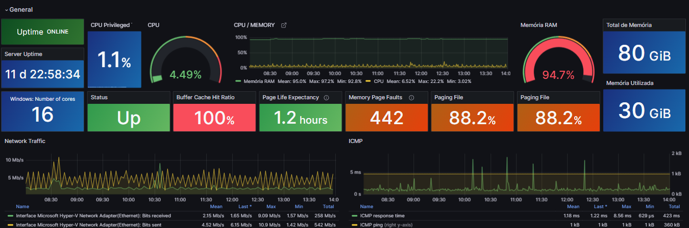
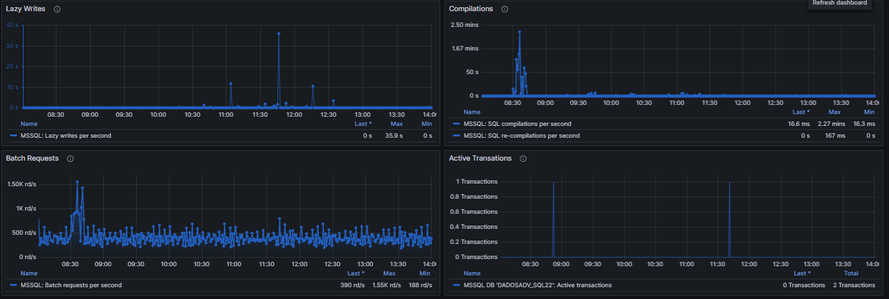
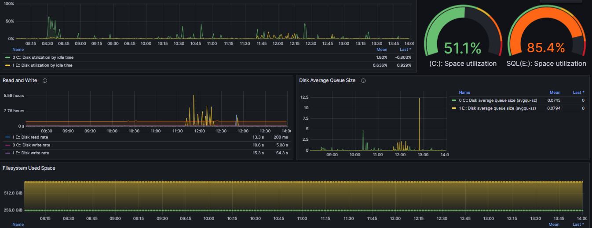
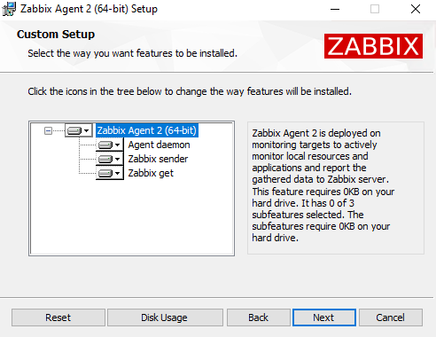
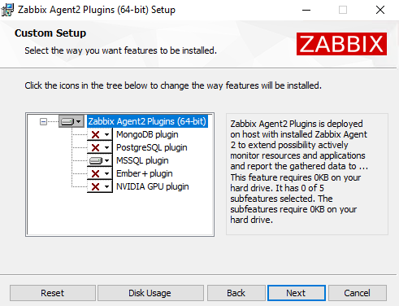
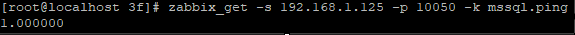
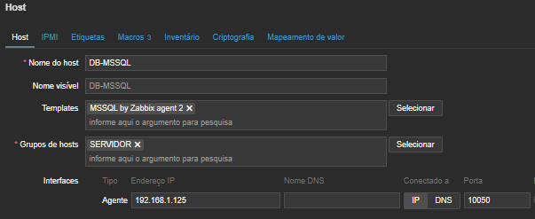
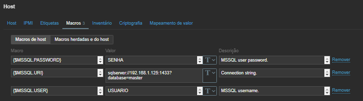
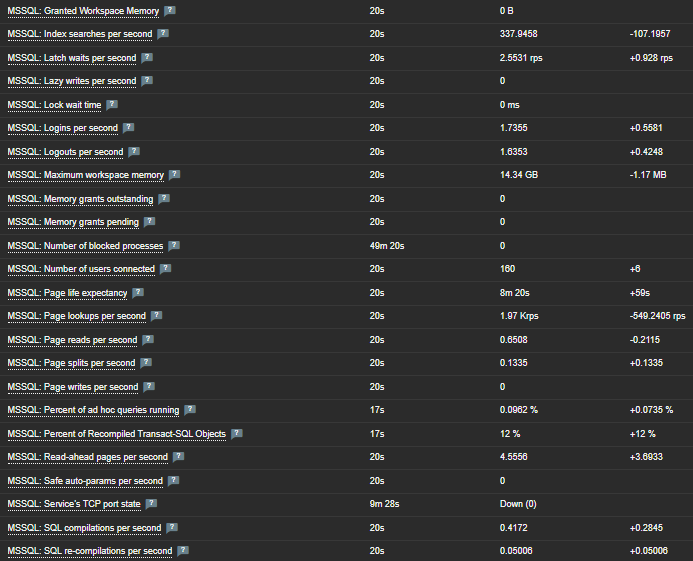

# monitoring_mssql_zabbix
Zabbix monitoring and collecting Microsoft SQL Server via agent2


### Guia prático para monitorar Microsoft SQL Server via Zabbix Agent 2 + Dashboard Grafana.
--------------------

# Dashboard








# Deploy

*Zabbix Version =* 7.4 - 
*Documentação oficial*: https://www.zabbix.com/integrations/mssql

### Agent2 + Plugins

**1- Instale o Zabbix Agent2 no Server SQL e o Plugin MSSQL**



Instale o plugin MSSQL



*OBS:* As portas TCP 10050(entrada) e TCP 10051(saída) precisam estarem abertas.

**2- mssql.conf**

Crie um arquivo em **mssql.conf** em **\Zabbix Agent 2\zabbix_agent2.d\plugins.d\**

mssql.conf
````
# --- MSSQL plugin ---
Plugins.MSSQL.Default.Uri=sqlserver://IP_DO_SERVER?database=master
Plugins.MSSQL.Default.User=USUARIO
Plugins.MSSQL.Default.Password=SENHA
Plugins.MSSQL.Default.TrustServerCertificate=true
````

Adicione o plugin ao *zabbix_agent2.conf*
````
Include=C:\Program Files\Zabbix Agent 2\zabbix_agent2.d\plugins.d\*.conf
````

**Reinicie o Serviço do agent.**

Realize um teste direto do server zabbix para testar a conexão, o retorno de **mssql.ping** deve ser **1**.
````
zabbix_get -s IP_SQL -p 10050 -k mssql.ping
````




-----------------------------

**3- Front Zabbix**

Adicione o host com o template **MSSQL by Zabbix agent 2**.



Altere as Macros para o seu server.
````
{$MSSQL.URI}: IP
{$MSSQL.USER}: USUARIO
{$MSSQL.PASSWORD}: SENHA
````




**Dados Recentes:**




Permissões User SQL:
````
GRANT SELECT ON OBJECT::msdb.dbo.sysjobs TO zbx_monitor;
GRANT SELECT ON OBJECT::msdb.dbo.sysjobservers TO zbx_monitor;
GRANT SELECT ON OBJECT::msdb.dbo.sysjobactivity TO zbx_monitor;
GRANT EXECUTE ON OBJECT::msdb.dbo.agent_datetime TO zbx_monitor;
````


